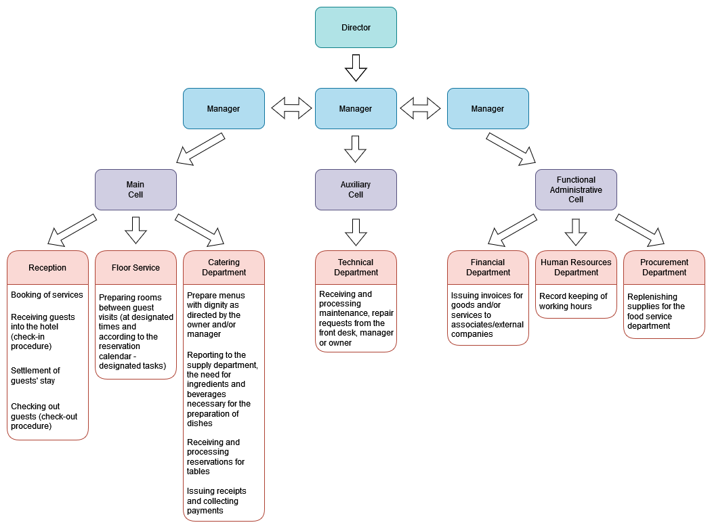

# Sample Data Base

## Hotel Manager
Hotel Manager is the first sample database, modeled on Sakila, among others, designed to help you learn SQL.
There are separate scripts for MySQL and PostgreSQL to create tables and common scripts to feed the database with data in Polish or English.
For PostgreSQL, before loading the hotel_manager_schema_postgresql.sql file (which creates the tables), first create a database, e.g. in pgAdmin.
For MySQL, just load the hotel_manager_schema_mysql.sql file (in phpmyadmin you don't need to disable foreign key checking).

### Structure of the hotel

1. The administrator manages (adds, deletes) manager/manager accounts and their permissions.
2. managers can be assigned to individual cells or departments.
3. Managers manage employee and associate accounts and their permissions.
4. Employees (including managers) have a file with data necessary for human resources and accounting including, unique identifier, position, address, contact information, working hours (schedule), hours worked.
5. each employee has an account, with a schedule, number of hours worked and tasks.
6. Each employee and co-worker/company has one or more assigned functions that he or she performs. They must also be assigned to the appropriate departments in the appropriate cells.
7. Cells are divided into: main, auxiliary, functional-administrative.
8. The main cell is divided into: reception, floor service, catering department.
9. Auxiliary cell is divided into: technical department.
10. Functional-administrative cell is divided into: financial department, human resources department, procurement department.
11. Responsibilities of the reception desk: 
	a. Booking of services. 
	b. Receiving guests into the hotel (check-in procedure). 
	c. Settlement of guests' stay. 
	d. Checking out guests (check-out procedure).
12. Duties of floor service: 
	a. Preparing rooms between guest visits (at designated times and according to the reservation calendar - designated tasks).
13. Responsibilities of the food service department: 
	a. Prepare menus with dignity as directed by the owner and/or manager. 
	b. Reporting to the supply department, the need for ingredients and beverages necessary for the preparation of dishes. 
	c. Receiving and processing reservations for tables. 
	d. Issuing receipts and collecting payments.
14. Responsibilities of the technical department: 
	a. Receiving and processing maintenance, repair requests from the front desk, manager or owner.
15. Responsibilities of the finance department: 
	a. Issuing invoices for goods and/or services to associates/external companies.
16. Responsibilities of the human resources department: 
	a. Record keeping of working hours.
17. Responsibilities of the procurement department: 
	a. Replenishing supplies for the food service department.
18. A hotel guest, is a person using at least an overnight stay.
19. A customer, is a person who does not use an overnight stay, but uses a restaurant, for example.
20. A guest can book a room online (must register and provide the necessary data: email, address data). He pays for his stay at the hotel during check-out, (optionally) also for catering services (meals, drinks).
21. Both the guest and the customer can make table reservations.
22. The customer pays for meals and drinks at the restaurant.
23. The guest can pay for meals and beverages both in the restaurant and can request that the entire hotel stay be added to the bill.
24. Both the guest and the customer may request an invoice.
25. The invoice is issued and issued by the reception after completing the necessary data of the guest/customer.
