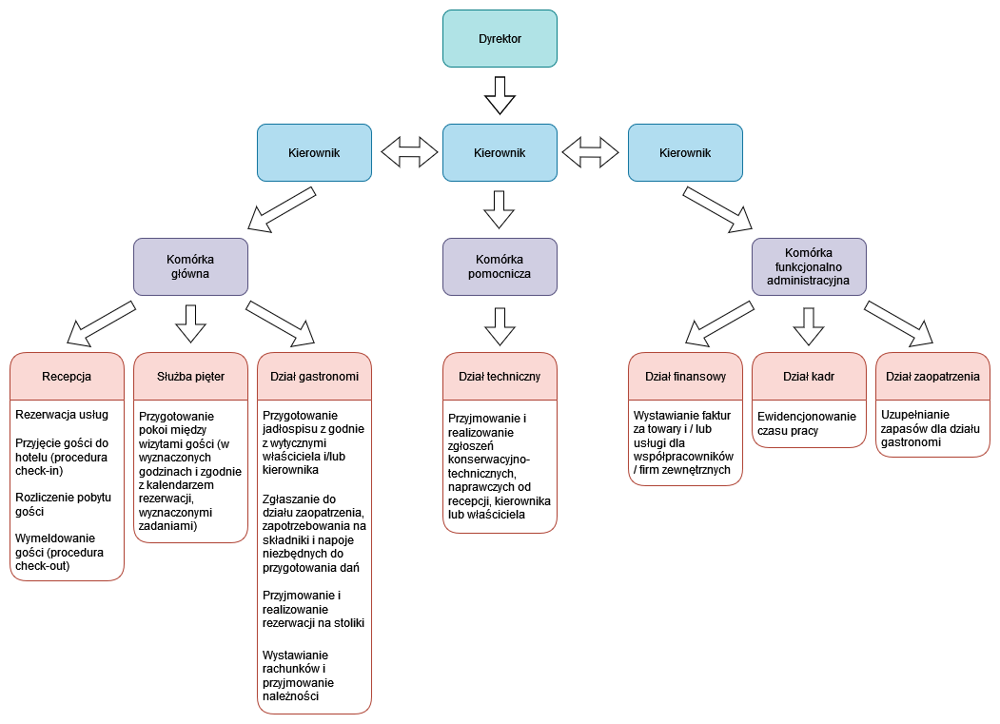

# Sample Data Base

## Hotel Manager
Hotel Manager to pierwsza przykładowa baza danych, wzorowana między innymi na Sakila, zaprojektowana w celu ułatwienia nauki SQL. 
Dla MySQL i PostgreSQL są odrębne skrypty tworzące tabele oraz wspólne skrypty do zasilenia bazy danych danymi w języku polskim lub angielskim.
Dla PostgreSQL przed wczytaniem pliku hotel_manager_schema_postgresql.sql (tworzącego tabele) najpierw utwórz bazę danych np w pgAdmin.
Dla MySQL wystarczy wczytać plik hotel_manager_chema_mysql.sql (w phpmyadmin nie trzeba wyłączać sprawdzania kluczy obcych).

### Struktura hotelu

1. Administrator zarządza (dodaje, usuwa) kontami menadżerów/kierowników oraz ich uprawnieniami.
2. Menadżerowie mogą być przydzieleni do poszczególnych komórek lub działów.
3. Menadżerowie zarządzają kontami pracowników i współpracowników oraz ich uprawnieniami.
4. Pracownicy (także menadżerowie) posiadają kartotekę z danymi niezbędnymi dla kadr i księgowości w tym, unikalnym identyfikatorem, stanowiskiem, adresem, danymi kontaktowymi, godzinami pracy (grafik), przepracowanymi godzinami.
5. Każdy z pracowników posiada konto, z grafikiem, liczbą przepracowanych godzin oraz zadaniami.
6. Każdy pracownik oraz współpracownik/firma ma przypisaną jedną lub więcej funkcji, które pełni. Musi być też przypisany do odpowiednich działów w odpowiednich komórkach.
7. Komórki dzielą się na: główne, pomocnicze, funkcjonalno-administracyjne.
8. Komórka główna dzieli się na: recepcję, służbę pięter, dział gastronomi.
9. Komórka pomocnicza dzieli się na: dział techniczny.
10. Komórka funkcjonalno-administracyjna dzieli się: dział finansowy, dział kadr, dział zaopatrzenia.
11. Obowiązki recepcji: 
	a. Rezerwacja usług. 
	b. Przyjęcie gości do hotelu (procedura check-in). 
	c. Rozliczenie pobytu gości. 
	d. Wymeldowanie gości (procedura check-out).
12. Obowiązki służby pięter: 
	a. Przygotowanie pokoi między wizytami gości (w wyznaczonych godzinach i zgodnie z kalendarzem rezerwacji - wyznaczonymi zadaniami).
13. Obowiązki działu gastronomi: 
	a. Przygotowanie jadłospisu z godnie z wytycznymi właściciela i/lub kierownika. 
	b. Zgłaszanie do działu zaopatrzenia, zapotrzebowania na składniki i napoje niezbędnych do przygotowania dań. 
	c. Przyjmowanie i realizowanie rezerwacji na stoliki. 
	d. Wystawianie rachunków i przyjmowanie należności.
14. Obowiązki działu technicznego: 
	a. Przyjmowanie i realizowanie zgłoszeń konserwacyjno-technicznych, naprawczych od recepcji, kierownika lub właściciela.
15. Obowiązki działu finansowego: 
	a. Wystawianie faktur za towary i/lub usługi dla współpracowników/firm zewnętrznych.
16. Obowiązki działu kadr: 
	a. Ewidencjonowanie czasu pracy.
17. Obowiązki działu zaopatrzenia: 
	a. Uzupełnianie zapasów dla działu gastronomi.
18. Gość hotelowy, to osoba korzystająca co najmniej z noclegu.
19. Klient, to osoba nie korzystająca z noclegu, ale korzystająca np. z restauracji.
20. Gość może zarezerwować pokój on-line (musi się zarejestrować i podać niezbędne dane: email, dane adresowe). Za pobyt w hotelu płaci podczas wymeldowania, (opcjonalnie) także za usługi gastronomiczne (posiłki, napoje).
21. Zarówno gość jak i klient może dokonywać rezerwacji stolików.
22. Klient płaci za posiłki i napoje w restauracji.
23. Gość może zapłacić za posiłki i napoje zarówno w restauracji jak i może zażądać doliczenia do rachunku za cały pobyt w hotelu.
24. Zarówno gość jak i klient mogą zażądać faktury.
25. Fakturę wystawia i wydaje recepcja po uprzednim uzupełnieniu niezbędnych danych gościa/klienta.